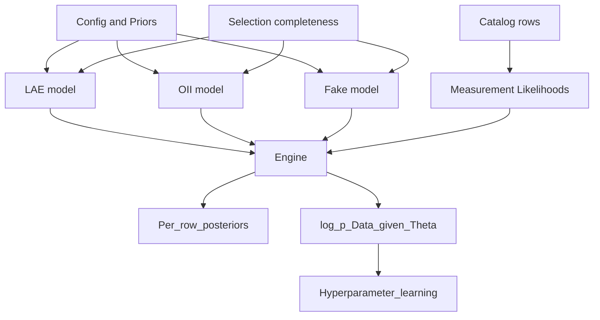
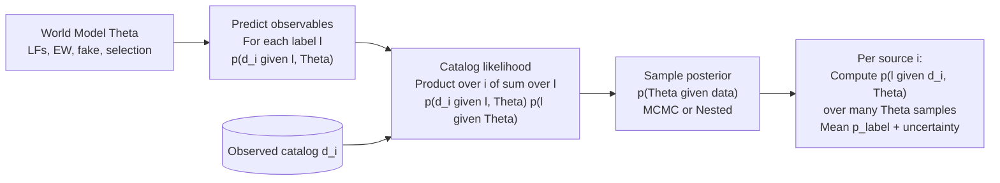

# JaynesLineClassifier

A Jaynesian inference engine for labeling emission-line candidates by combining spectral measurements, selection models, cosmology + luminosity‑function (LF) priors, and observed‑space rate densities. The design follows E. T. Jaynes’ program: state what you know (priors), what you measured (likelihoods), and then update beliefs by the rules of probability—nothing more, nothing less.

## Install (Conda only)

The recommended way to set up a working environment is with Conda using the conda-forge channel. Use the provided environment.yml to create the environment, then install this project into that environment.

1) Create and activate the Conda environment from environment.yml
- macOS/Linux/Windows (PowerShell or cmd):
  - conda env create -f environment.yml
  - conda activate jlc

2) Install JaynesLineClassifier into the active Conda environment
- From the repository root:
  - python -m pip install -e .

## Quickstart: Classify a catalog
Given a CSV file with at least the columns: id, wave_obs, flux_hat, flux_err

- jlc classify path/to/input.csv --out path/to/output.csv

The output CSV will include, for each configured label (default: lae, oii, fake):
- logZ_<label>: flux-marginalized log-evidence from the measurement model(s)
- p_<label>: posterior probability after combining evidence with rate priors

Columns in the simulated catalog (both modes):
- ra, dec, true_class, wave_obs, flux_hat, flux_err, snr (if --snr-min provided, only rows with snr >= threshold are kept)

---

## Why Jaynes? A short motivation
Jaynes advocated that probability is extended logic. In this view, a classifier should:
- Encode prior state of knowledge (population models, cosmology, selection effects) in explicit priors.
- Encode what was actually measured (fluxes, wavelengths, uncertainties) in explicit likelihoods.
- Combine them consistently to form posteriors, with all normalizing constants handled explicitly.

In emission‑line labeling, the prior is not just “class frequency.” It is physically structured: a luminosity function φ(L), cosmological geometry dV/dz, and a selection function S(F, λ) describing detection completeness. Together these yield an observed‑space rate density that functions as a principled, data‑driven prior for what we expect to see before looking at a specific noisy measurement. The likelihood captures measurement noise (e.g., Gaussian on flux). Jaynes’ prescription then gives posteriors and, when desired, a data likelihood for learning hyperparameters Θ.

---

## System goal and flow (Mermaid)

---

## Mathematical background: from rate densities to probabilities
This section summarizes the core quantities in units you can check, and how they combine to produce per‑row posteriors.

1) Geometry and mappings
- Observed wavelength λ_obs and rest wavelength λ_rest define redshift: z = λ_obs / λ_rest − 1.
- Luminosity distance d_L(z) in Mpc. Convert to cm with 1 Mpc = 3.08567758e24 cm.
- Flux F (erg s^-1 cm^-2) maps to luminosity L (erg s^-1) via L = 4π d_L(z)^2 F.
- Jacobian from wavelength to redshift: |dz/dλ| = 1 / λ_rest (Å^-1).

2) Population model (prior in observed space)
- Start from a luminosity function φ(L) with units [Mpc^-3 per (erg s^-1)].
- Differential comoving volume element per unit redshift per steradian: dV/dz(z) [Mpc^3 sr^-1].
- Selection completeness C(F, λ | label) ∈ [0, 1].
- Map φ(L) into flux space using L(F, z) and dL/dF = 4π d_L(z)^2 (cm^2). Then define the per‑flux observed‑space rate density (per sr per Å per flux):
  r_F(F, λ) = (dV/dz)(z) · φ(L(F, z)) · (dL/dF) · C(F, λ) · |dz/dλ|.
  Units check: [Mpc^3/sr] · [1/(Mpc^3·L)] · [L/F] · [1] · [1/Å] → [1/(sr·Å·F)].

- Integrating over F gives the expected counts per sr per Å at λ:
  r(λ) = ∫ r_F(F, λ) dF. In practice we convolve with measurement uncertainty (next).

3) Measurement model and convolution over latent flux
- For a catalog row with measured flux_hat and known noise σ = flux_err, the Gaussian likelihood for latent F_true is p(F_hat | F_true) = N(F_hat; mean=F_true, σ).
- The rate at the measured point (λ_obs, F_hat) is the convolution over the latent F_true:
  r_meas(λ_obs, F_hat) = ∫ r_F(F_true, λ_obs) · p(F_hat | F_true) dF_true.
- In the code, this is rate_density_local(...), numerically integrating over a positive flux grid.

4) Evidence from measurement modules
- For each label, measurement modules provide a marginalized log‑evidence logZ_label(row). With deterministic‑from‑z wavelength priors, the wavelength module contributes 0; the flux module integrates out the latent flux given noise.

5) Per‑row posterior probabilities (classification)
- For labels L ∈ {lae, oii, fake}, combine measurement evidence with the observed‑space rate and optional global priors w_L (e.g., PPP expected class weights):
  log weight_L(row) = logZ_L(row) + log r_meas,L(row) + log w_L.
- Normalize across labels to obtain posteriors p_L(row) via softmax:
  p_L(row) = exp(log weight_L − logsumexp_over_labels(log weight)).
- If you want “rate‑only” behavior for diagnostics, omit logZ; if you want “likelihood‑only,” omit log r.

6) Effective search measure and volume modes
- An optional effective_search_measure(row, ctx) multiplies all rates (neutral by default). It represents exposure, number of fibers/IFUs, and other survey coverage factors; treat it as a scalar converting per‑sr per‑Å to expected counts in your search configuration.
- Real vs virtual volume: in “virtual” mode, physical labels’ rates can be suppressed (used for ablation/diagnostics), while fake remains.

7) Units at a glance
- φ(L): 1 / (Mpc^3 · erg s^-1)
- dV/dz: Mpc^3 / sr
- dL/dF: 4π d_L^2 (cm^2)
- |dz/dλ|: 1 / Å
- r_F(F, λ): 1 / (sr · Å · flux)
- r_meas(λ, F_hat): 1 / (sr · Å)

---

## Under the hood (for developers)
- Observed‑space rate density per label is computed in jlc.core.population_helpers:
  - r_F(F, λ) = (dV/dz) · φ(L(F, z)) · (dL/dF) · C(F, λ) · |dz/dλ|.
  - r_meas(λ, F_hat) = ∫ r_F(F_true, λ) · N(F_hat; F_true, σ) dF_true.
- Posteriors combine logZ (from measurement likelihoods marginalized over latent flux) with log(rate) and optional global weights, then apply a log‑softmax across labels.
- effective_search_measure(row, ctx) multiplies all rates; neutral (1.0) by default and serves as the hook for survey geometry/coverage.

---

## Citations
- Jaynes, E. T. (2003), Probability Theory: The Logic of Science.
- Standard Schechter LF parameterizations as configured in configs/priors; cosmology via astropy (Planck18).

